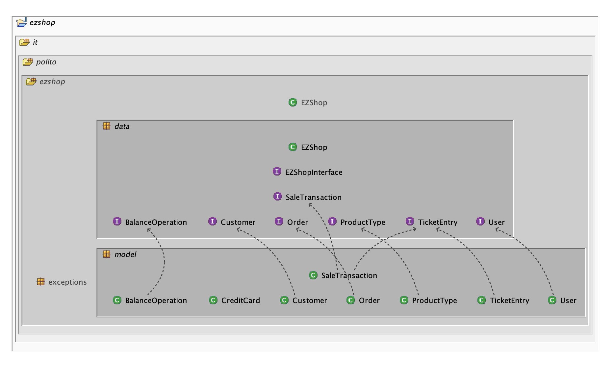
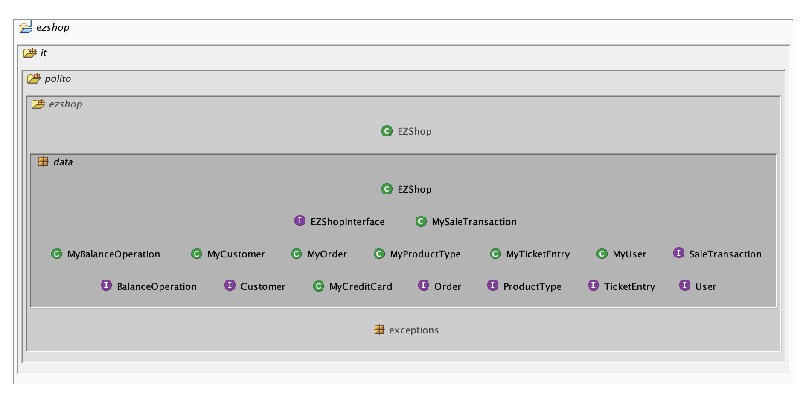
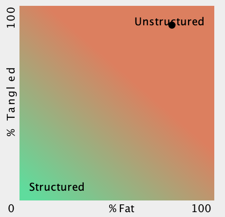
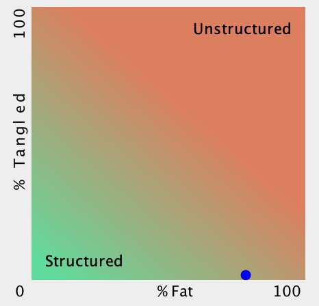
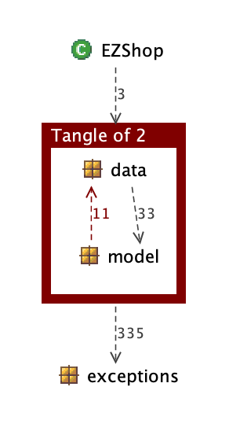

# Design assessment

Authors: Roberto A., Michelangelo B., Gianvito M., Roberto T.

Date: 10/06/2021

Version: 1.1

# Levelized structure map

## Before untangle

## After untangle and Changes2

# Structural over complexity chart

## Before untangle

## After untangle and Changes2

# Size metrics

## Before untangle

| Metric                                    | Measure |
| ----------------------------------------- | ------- |
| Packages                                  | 6       |
| Classes (outer)                           | 37      |
| Classes (all)                             | 37      |
| NI (number of bytecode instructions)      | 6359    |
| LOC (non comment non blank lines of code) | ~2734   |

## After untangle

| Metric                                    | Measure |
| ----------------------------------------- | ------- |
| Packages                                  | 5       |
| Classes (outer)                           | 37      |
| Classes (all)                             | 37      |
| NI (number of bytecode instructions)      | 6359    |
| LOC (non comment non blank lines of code) | ~2734   |

## After Changes2

| Metric                                    | Measure |
| ----------------------------------------- | ------- |
| Packages                                  | 5       |
| Classes (outer)                           | 38      |
| Classes (all)                             | 38      |
| NI (number of bytecode instructions)      | 7173    |
| LOC (non comment non blank lines of code) | ~3084   |

# Items with XS

## Before untangle

| Item                                                                                                                 | Tangled | Fat  | Size | XS   |
| -------------------------------------------------------------------------------------------------------------------- | ------- | ---- | ---- | ---- |
| ezshop.it.polito.ezshop.data.EZShop                                                                                  | 0%      | 158  | 5318 | 1279 |
| ezshop.it.polito.ezshop                                                                                              | 3%      |   4  | 6359 | 183  |
| ezshop.it.polito.ezshop.data.EZShop.endReturnTransaction(java.lang.Integer, boolean):boolean                         | 0%      |  25  | 309  | 123  |
| ezshop.it.polito.ezshop.data.EZShop.returnProduct(java.lang.Integer, java.lang.String, int):boolean                  | 0%      |  22  | 222  | 70   |
| ezshop.it.polito.ezshop.data.EZShop.deleteProductFromSale(java.lang.Integer, java.lang.String, int):boolean          | 0%      |  21  | 192  | 54   |
| ezshop.it.polito.ezshop.data.EZShop.addProductToSale(java.lang.Integer, java.lang.String, int):boolean               | 0%      |  20  | 207  | 51   |
| ezshop.it.polito.ezshop.data.EZShop.deleteSaleTransaction(java.lang.Integer):boolean                                 | 0%      |  17  | 169  | 19   |
| ezshop.it.polito.ezshop.data.EZShop.modifyCustomer(java.lang.Integer, java.lang.String, java.lang.String):boolean    | 0%      |  17  | 160  | 18   |
| ezshop.it.polito.ezshop.data.EZShop.applyDiscountRateToProduct(java.lang.Integer, java.lang.String, double):boolean  | 0%      |  16  | 147  | 9    |

## After untangle

| Item                                                                                                                 | Tangled | Fat  | Size | XS   |
| -------------------------------------------------------------------------------------------------------------------- | ------- | ---- | ---- | ---- |
| ezshop.it.polito.ezshop.data.EZShop                                                                                  | 0%      | 158  | 5318 | 1279 |
| ezshop.it.polito.ezshop.data.EZShop.endReturnTransaction(java.lang.Integer, boolean):boolean                         | 0%      |  25  | 309  | 123  |
| ezshop.it.polito.ezshop.data.EZShop.returnProduct(java.lang.Integer, java.lang.String, int):boolean                  | 0%      |  22  | 222  | 70   |
| ezshop.it.polito.ezshop.data.EZShop.deleteProductFromSale(java.lang.Integer, java.lang.String, int):boolean          | 0%      |  21  | 192  | 54   |
| ezshop.it.polito.ezshop.data.EZShop.addProductToSale(java.lang.Integer, java.lang.String, int):boolean               | 0%      |  20  | 207  | 51   |
| ezshop.it.polito.ezshop.data.EZShop.deleteSaleTransaction(java.lang.Integer):boolean                                 | 0%      |  17  | 169  | 19   |
| ezshop.it.polito.ezshop.data.EZShop.modifyCustomer(java.lang.Integer, java.lang.String, java.lang.String):boolean    | 0%      |  17  | 160  | 18   |
| ezshop.it.polito.ezshop.data.EZShop.applyDiscountRateToProduct(java.lang.Integer, java.lang.String, double):boolean  | 0%      |  16  | 147  | 9    |

## After changes2

| Item                                                                                                                 |  Tangle | Fat  | Size | XS   |
| -------------------------------------------------------------------------------------------------------------------- | ------- | ---- | ---- | ---- |
| ezshop.it.polito.ezshop.data.EZShop                                                                                  | 0%      |  176 | 6118 | 1946 |
| ezshop.it.polito.ezshop.data.EZShop.endReturnTransaction(java.lang.Integer, boolean):boolean                         | 0%      |   25 | 309  | 123  |
| ezshop.it.polito.ezshop.data.EZShop.returnProduct(java.lang.Integer, java.lang.String, int):boolean                  | 0%      |   22 | 222  | 70   |
| ezshop.it.polito.ezshop.data.EZShop.recordOrderArrivalRFID(java.lang.Integer, java.lang.String):boolean              | 0%      |   21 | 225  | 64   |
| ezshop.it.polito.ezshop.data.EZShop.deleteProductFromSale(java.lang.Integer, java.lang.String, int):boolean          | 0%      |   21 | 192  | 54   |
| ezshop.it.polito.ezshop.data.EZShop.addProductToSale(java.lang.Integer, java.lang.String, int):boolean               | 0%      |   20 | 207  | 51   |
| ezshop.it.polito.ezshop.data.EZShop.addProductToSaleRFID(java.lang.Integer, java.lang.String):boolean                | 0%      |   19 | 195  | 41   |
| ezshop.it.polito.ezshop.data.EZShop.returnProductRFID(java.lang.Integer, java.lang.String):boolean                   | 0%      |   18 | 185  | 30   |
| ezshop.it.polito.ezshop.data.EZShop.deleteProductFromSaleRFID(java.lang.Integer, java.lang.String):boolean           | 0%      |   17 | 186  | 21   |
| ezshop.it.polito.ezshop.data.EZShop.deleteSaleTransaction(java.lang.Integer):boolean                                 | 0%      |   17 | 169  | 19   |

# Package level tangles

## Before untangle

## After untangle and Changes2

No tangles found.

# Summary analysis

In relation to the previous project structure, it has been changed as following:

- Removed the "list" classes (including Inventory and AccountBook) and implemented the corresponding methods directly inside `ezshop.it.polito.ezshop.data.EZShop` class;

- Moved all the classes' implementation from `model` to `data` package (removing the tangle between data and model packages);

- Removed `Quantity` and `Position` classes because they've been implemented as attributes of `ProductType` in the database;

- Merged `LoyaltyCard` and `Customer` classes because it is a 1-to-1 association;

- Removed `ReturnTransaction` class because it has been implemented on the database side and so was superfluous in the Java structure.

Despite the fact that we managed to resolve the tangling between `data` and `model` packages, the main weakness in the current structure remains the fatness of `ezshop.it.polito.ezshop.data.EZShop` class which implements the APIs.
The probable reason for this problem is the repetion of multiple lines of code which does the same things over multiple methods.
Possible solutions to this problem could be:

- semplification of methods called from the APIs which operate on the database using a "db management" class to group repetitively called operations;

- a class that groups all the exceptions check at the start of each method.

Following this coding methodology we can semplify the code and structural complexity of each method by calling smaller and distinct sub-methods.
