## Graphical User Interface Prototype  

Authors: Roberto Alessi (290180), Michelangelo Bartolomucci (292422), Gianvito Marzo (281761), Roberto Torta (290184)

Date: 19/04/2021

Version: 1.0

# Login GUI
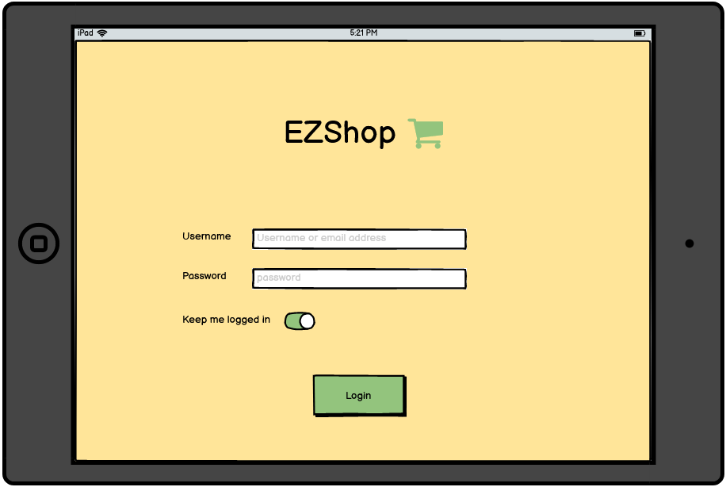

# Use Case 1 Scenario 1.1
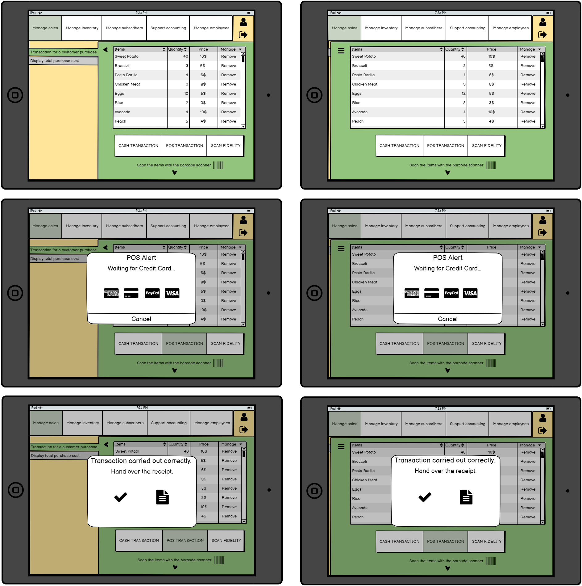

# Use Case 1 Scenario 1.2
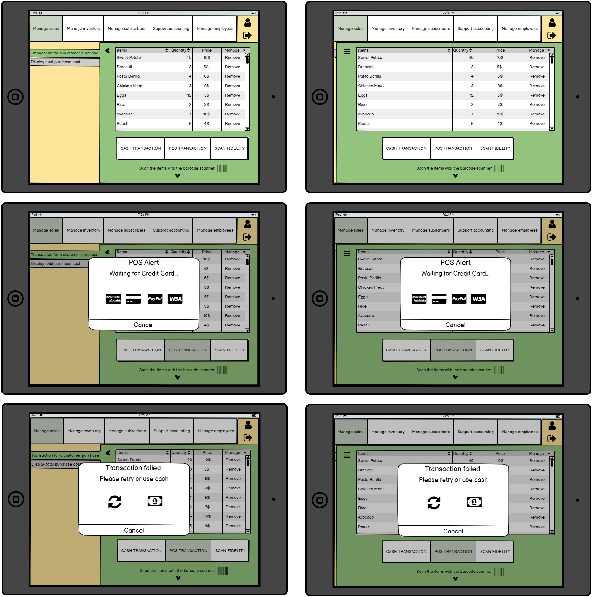

# Use Case 1 Scenario 1.3
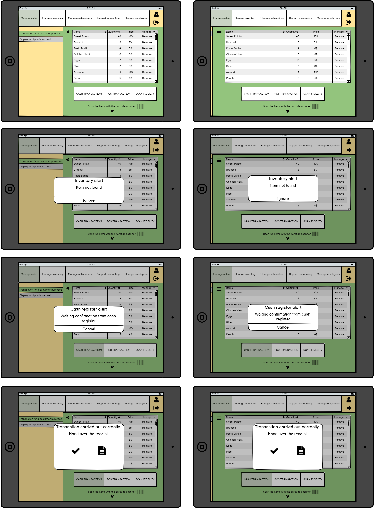

# Use Case 2 (Scenario 2.1)
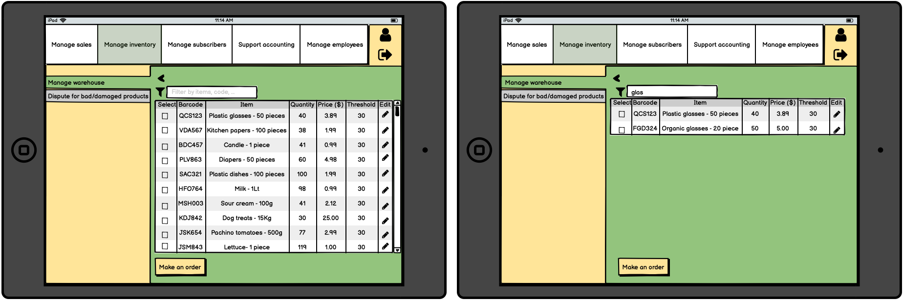

# Use Case 2 (Scenario 2.2)
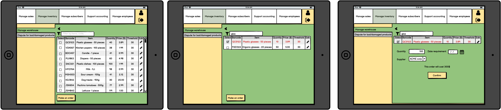

# Use Case 3 (Scenario 3.1)
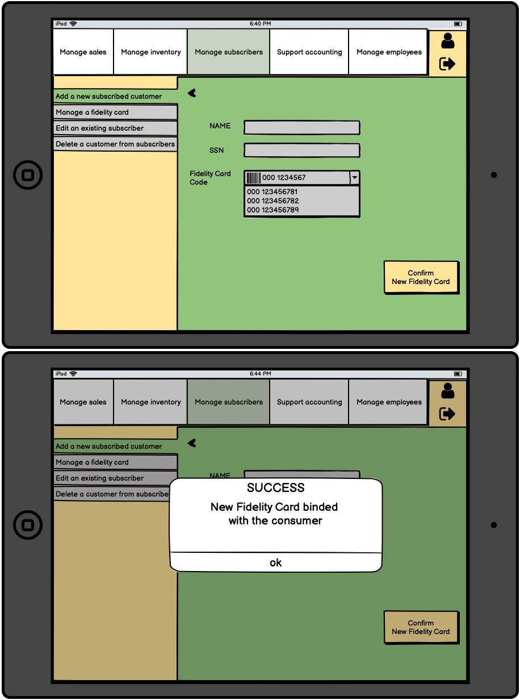

# Use Case 3 (Scenario 3.2)
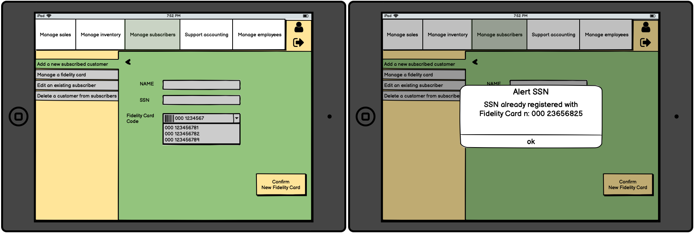

# FR 3.2
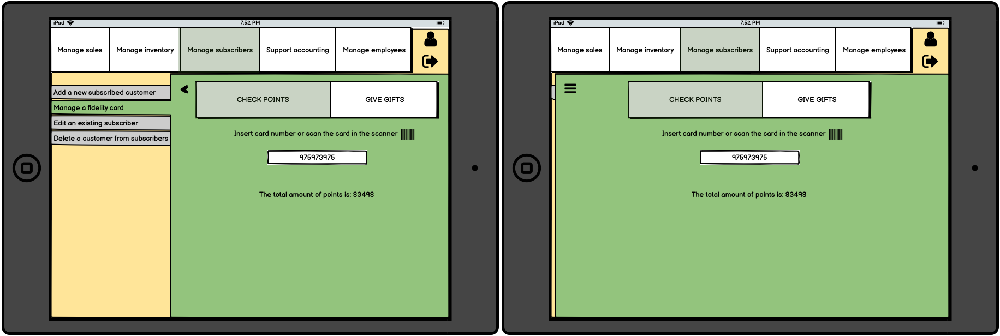

# Use Case 4 (Scenario 4.1)
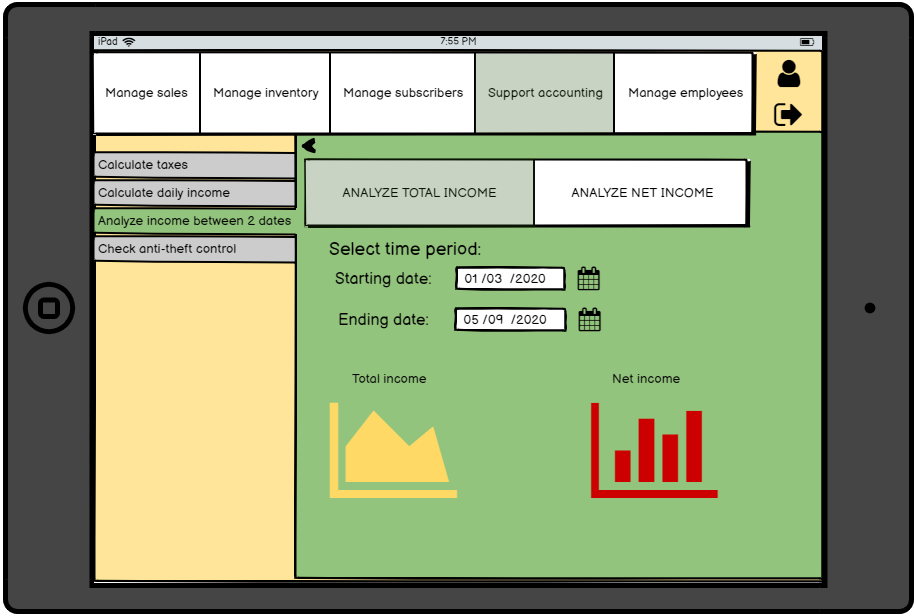

# Use Case 4 (Scenario 4.2)
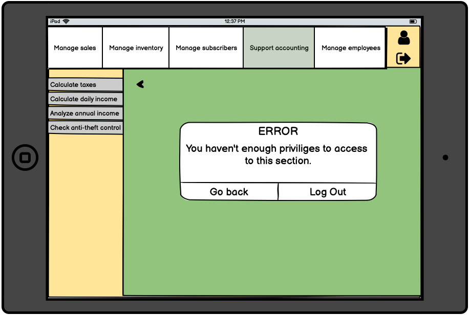

# Use Case 5 (Scenario 5.1)
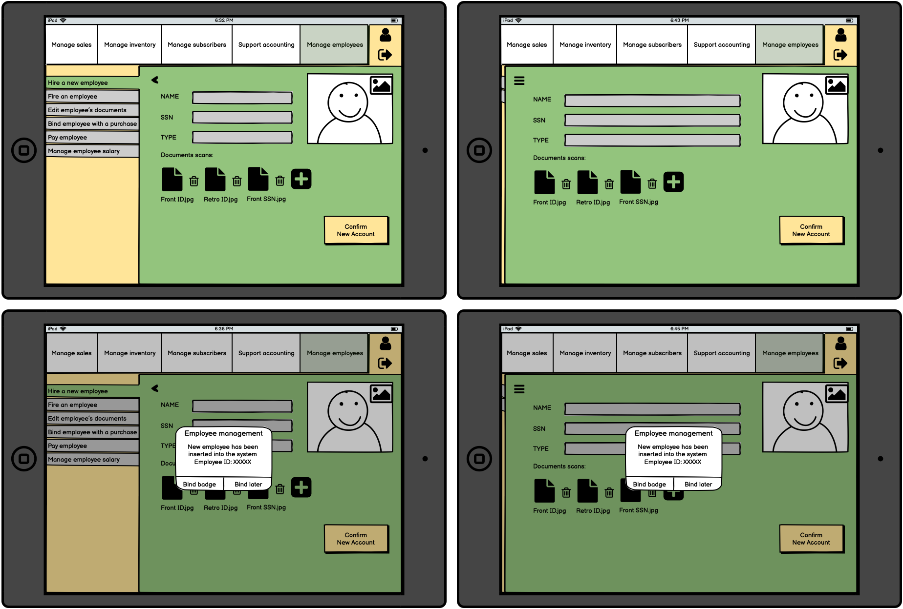

# Use Case 5 (Scenario 5.2)
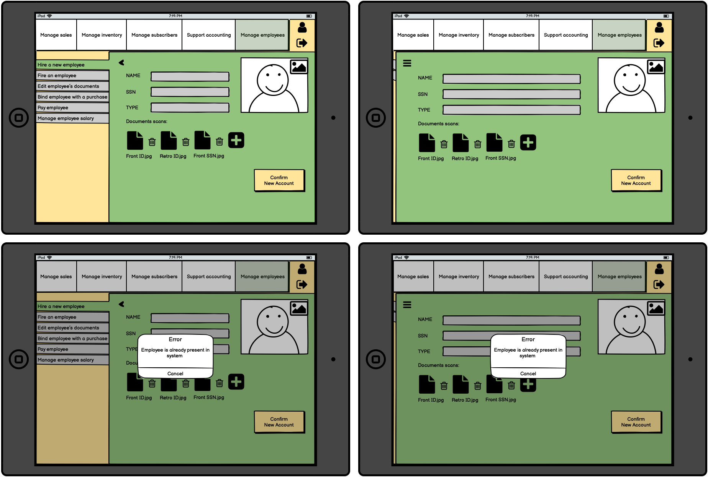

# Use Case 5 (Scenario 5.3)
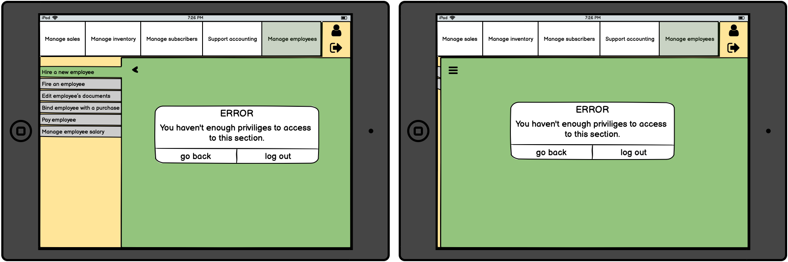
