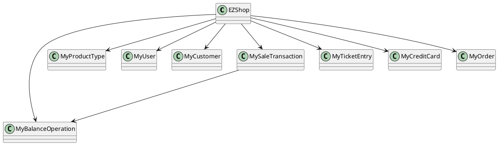
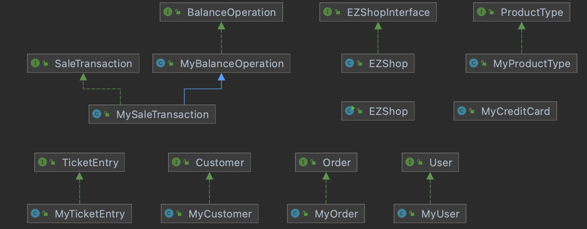
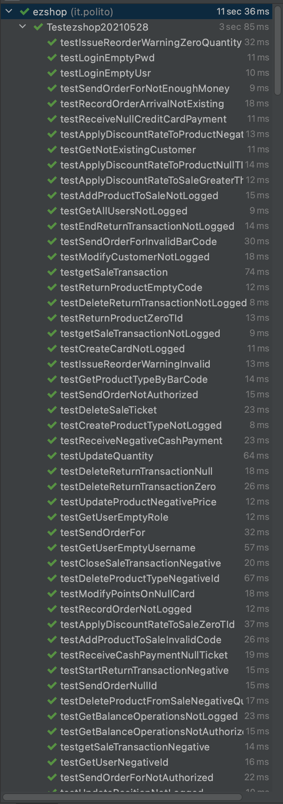
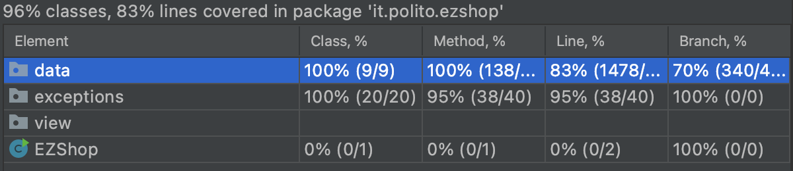

# Integration and API Test Documentation

Authors: Roberto Alessi (290180), Michelangelo Bartolomucci (292422), Gianvito Marzo (281761), Roberto Torta (290184)

Date: 10/06/2021

Version: 1.2

# Contents

- [Dependency graph](#dependency graph)
- [Integration approach](#integration)
- [Tests](#tests)
- [Scenarios](#scenarios)
- [Coverage of scenarios and FR](#scenario-coverage)
- [Coverage of non-functional requirements](#nfr-coverage)
- [Coverage of methods and code lines](#Coverage-of-methods-and-code-lines)

# Dependency graph

# Integration approach

## Step 1

Unit test of classes MyUser, MyCustomer, MyProductType, MyOrder, MySaleTransaction, MyTicketEntry, MyCreditCard, MyBalanceOperation

## Step 2

Integration test of MyUser methods from API and reset

## Step 3

Integration test of MyCustomer, ProductType, LoyalityCard methods from API

## Step 4

Integration test of MyOrder methods from API

## Step 5

Integration test of MySaleTransaction, MyReturnTransaction, MyTicketEntry methods from API

## Step 6

Integration test of MyCreditCard, MyBalanceOperation methods from API

#  Tests

## Step 1

This step corresponds to Unit testing.

## Step 2

| Classes                   | JUnit test cases           |
|---------------------------|----------------------------|
|AcceptableReset            |check1                      |
|                         * |check2                      |
|                         * |check3                      |
|                         * |check4                      |
|AcceptableCreateUser       |testUsername                |
|                         * |testPassword                |
|                         * |testRole                    |
|                         * |testDuplicatedUsername      |
|                         * |testCorrectCase             |
|AcceptableDeleteUser       |deleteUser                  |
|                         * |deleteUsernameNotAuthorized |
|                         * |deleteUsernameNotPresent    |
|                         * |userNotLogged               |
|                         * |invalidUserId               |
|                         * |userDeletable               |
|AcceptableGetAllUsers      |testAuthorization           |
|                         * |testCorrect                 |
|AcceptableGetUser          |testAuthorization           |
|                         * |testCorrectId               |
|                         * |testGetUser                 |
|                         * |testNotFoundUser            |
|AcceptableUpdateUserRights |userNotLogged               |
|                         * |userNotAuthorized           |
|                         * |invalidUserId               |
|                         * |invalidRole                 |
|                         * |userNotPresent              |
|AcceptableLogin            |testUsername                |
|                         * |testPassword                |
|                         * |testTwoLoggedUser           |
|AcceptableLogout           |testNotLoggedUser           |
|                         * |testCorrectCase             |

## Step 3

| Classes                               | JUnit test cases           |
|-------------------------------------- |----------------------------|
|AcceptableDefineCustomer               |authTest                    |
|                                     * |testCustomerName            |
|                                     * |testCorrectCase             |
|AcceptableModifyCustomer               |authTest                    |
|                                     * |modifyNameOnly              |
|                                     * |removeCard                  |
|                                     * |modifyCard                  |
|                                     * |modifyCardAlreadyAssigned   |
|                                     * |invalidName                 |
|                                     * |invalidCard                 |
|AcceptableDeleteCustomer               |authTest                    |
|                                     * |testId                      |
|                                     * |testCorrectCase             |
|AcceptableGetAllCustomers              |unLoggedIn                  |
|                                     * |cashierLoggedIn             |
|AcceptableGetCustomer                  |authTest                    |
|                                     * |testId                      |
|                                     * |testCorrectCase             |
|AcceptableCreateProductType            |testAuthorization           |
|                                     * |testPricePerUnit            |
|                                     * |testDescription             |
|                                     * |testProductCode             |
|                                     * |testErrorCase               |
|                                     * |testCorrectCase             |
|AcceptableDeleteProductType            |testAuthorization           |
|                                     * |testProductId               |
|                                     * |testNoIdToDelete            |
|                                     * |testCorrectCase             |
|AcceptableGetAllProductTypes           |testAuthorization           |
|                                     * |testCorrectCase             |
|AcceptableGetProductTypeByBarcode      |testAuthorization           |
|                                     * |testProductCode             |
|                                     * |testNoProduct               |
|                                     * |testCorrectCase             |
|AcceptableGetProductTypeByDescription  |testAuthorization           |
|                                     * |testValid                   |
|                                     * |testMultipleValid           |
|                                     * |testNotValid                |
|AcceptableUpdatePosition               |testAuthorization           |
|                                     * |testProductId               |
|                                     * |testDuplicatePosition       |
|                                     * |testCorrectCase             |
|AcceptableUpdateProduct                |testAuthorization           |
|                                     * |testProductCode             |
|                                     * |testPricePerUnit            |
|                                     * |testDescription             |
|                                     * |testProductId               |
|                                     * |testNoProductId             |
|                                     * |testCorrectCase             |
|                                     * |testSameBarcodePresent      |
|                                     * |testValidBarcode            |
|AcceptableUpdateQuantity               |testAuthorization           |
|                                     * |testProductId               |
|                                     * |testToBeAdded               |
|                                     * |testCorrectCase             |
|AcceptableCreateCard                   |authTest                    |
|                                     * |correctCase                 |
|AcceptableAttachCardToCustomer         |authTest                    |
|                                     * |invalidCustomerId           |
|                                     * |invalidCardId               |
|                                     * |noUser                      |
|                                     * |alreadyAssigned             |
|                                     * |correctCase                 |
|AcceptableModifyPointsOnCard           |authTest                    |
|                                     * |cardIdNotPresent            |
|                                     * |invalidCardId               |
|                                     * |notEnoughPoints             |
|                                     * |correctCase                 |

## Step 4

| Classes                               | JUnit test cases           |
|-------------------------------------- |----------------------------|
|AcceptableIssueOrder                   |authTest                    |
|                                     * |invalidProductCode          |
|                                     * |validProductCodeNotInDB     |
|                                     * |invalidPricePerUnit         |
|                                     * |invalidQuantity             |
|                                     * |validOrder                  |
|AcceptablePayOrder                     |authTest                    |
|                                     * |testInvalidOrderId          |
|                                     * |testJustPayed               |
|                                     * |TestCorrectCase             |
|AcceptablePayOrderFor                  |authTest                    |
|                                     * |invalidProductCode          |
|                                     * |validProductCodeNotInDB     |
|                                     * |invalidPricePerUnit         |
|                                     * |invalidQuantity             |
|                                     * |notEnoughBalanceValidOrder  |
|                                     * |validOrder                  |
|AcceptableRecordOrderArrival           |authTest                    |
|                                     * |invalidOrderId              |
|                                     * |testCompletedState          |
|                                     * |testNoLocation              |
|                                     * |testCorrectCase             |
|AcceptableRecordOrderArrivalRFID       |authTest                    |
|                                     * |invalidOrderId              |
|                                     * |invalidFormatRFID           |
|                                     * |duplicateRFID               |
|                                     * |testNoLocation              |
|                                     * |testCompletedState          |
|                                     * |testCorrectCase             |
|AcceptableGetAllOrder                  |authTest                    |
|                                     * |correctCase                 |

## Step 5

| Classes                                | JUnit test cases               |
|--------------------------------------- |------------------------------- |
|AcceptableAddProductToSale              |authTest                        |
|                                      * |invalidTransactionId            |
|                                      * |invalidProductCodeException     |
|                                      * |invalidQuantity                 |
|                                      * |nonExistingProductCode          |
|                                      * |notEnoughQuantity               |
|                                      * |notStartedSaleTransaction       |
|                                      * |correctCase                     |
|AcceptableAddProductToSaleRFID          |authTest                        |
|                                      * |invalidTransactionId            |
|                                      * |invalidFormatRFID               |
|                                      * |RFIDNotPresent                  |
|                                      * |notStartedSaleTransaction       |
|                                      * |correctCase                     |
|                                      * |testMultipleAddSameProductToSale|
| AcceptableApplyDiscountRateToProduct   |authTest                        |
|                                      * |invalidTransactionId            |
|                                      * |invalidProductCodeException     |
|                                      * |invalidDiscountRateException    |
|                                      * |nonExistingProductCode          |
|                                      * |TransactionNotOpen              |
|                                      * |correctCase                     |
| AcceptableApplyDiscountRateToSale      |authTest                        |
|                                      * |invalidTransactionId            |
|                                      * |invalidDiscountRateException    |
|                                      * |nonExistingTransaction          |
|                                      * |correctCase                     |
| AcceptableComputePointsForSale         |authTest                        |
|                                      * |invalidTransactionId            |
|                                      * |nonExistingTransaction          |
|                                      * |correctCase                     |
| AcceptableDeleteProductFromSale        |authTest                        |
|                                      * |invalidTransactionId            |
|                                      * |invalidProductCodeException     |
|                                      * |invalidQuantity                 |
|                                      * |notEnoughQuantity               |
|                                      * |TransactionNotOpen              |
|                                      * |correctCase                     |
| AcceptableDeleteProductFromSaleRFID    |authTest                        |
|                                      * |invalidTransactionId            |
|                                      * |invalidFormatRFID               |
|                                      * |TransactionNotOpen              |
|                                      * |correctCase                     |
| AcceptableDeleteReturnTransaction      |authTest                        |
|                                      * |testIdCorrect                   |
|                                      * |testNoReturnTransactionId       |
|                                      * |testCorrectCase                 |
|                                      * |testPayed                       |
| AcceptableDeleteSaleTransaction        |authTest                        |
|                                      * |invalidTransactionId            |
|                                      * |nonExistingTransaction          |
|                                      * |transactionAlreadyPayed         |
|                                      * |correctCase                     |
| AcceptableEndReturnTransaction         |authTest                        |
|                                      * |testIdCorrect                   |
|                                      * |testNoReturnTransactionId       |
|                                      * |testCloseAgain                  |
|                                      * |testCorrectCase                 |
| AcceptableEndSaleTransaction           |authTest                        |
|                                      * |invalidTransactionId            |
|                                      * |nonExistingTransaction          |
|                                      * |transactionAlreadyClosed        |
|                                      * |correctCase                     |
| AcceptableGetSaleTransaction           |authTest                        |
|                                      * |testIdCorrect                   |
|                                      * |testNoTransactionPresent        |
|                                      * |testProductCase                 |
| AcceptableStartReturnTransaction       |authTest                        |
|                                      * |testIdCorrect                   |
|                                      * |testNoTransactionPresent        |
|                                      * |testCorrectCase                 |
| AcceptableStartSaleTransaction         |authTest                        |
|                                      * |testCorrectCase                 |
| AcceptableReturnProduct                |authTest                        |
|                                      * |testInvalidProductCode          |
|                                      * |testInvalidQuantity             |
|                                      * |testIdCorrect                   |
|                                      * |testNoProductInSaleTransaction  |
|                                      * |testNoProductInProductType      |
|                                      * |testTooHighQuantity             |
|                                      * |testNoReturnTransactionId       |
|                                      * |testCorrectCase                 |
| AcceptableReturnProductRFID            |authTest                        |
|                                      * |testInvalidRFID                 |
|                                      * |testInvalidQuantity             |
|                                      * |testIdCorrect                   |
|                                      * |testNoRFIDInSaleTransaction     |
|                                      * |testNoReturnTransactionId       |
|                                      * |testCorrectCase                 |
|                                      * |testMultipleReturnSameRFID      |
|                                      * |testMultipleReturnTransaction   |

## Step 6

| Classes                               | JUnit test cases           |
|-------------------------------------- |----------------------------|
|AcceptableReceiveCashPayment           |authTest                    |
|                                     * |testIdCorrect               |
|                                     * |testInvalidPayment          |
|                                     * |testSaleDoesNotExist        |
|                                     * |testNoMoney                 |
|                                     * |testCorrectCase             |
|AcceptableReceiveCreditCardPayment     |authTest                    |
|                                     * |testIdCorrect               |
|                                     * |testNoSaleTransactionId     |
|                                     * |testCreditCard              |
|                                     * |testCorrectCase             |
|AcceptableReturnCashPayment            |authTest                    |
|                                     * |testIdCorrect               |
|                                     * |testNoReturnTransactionId   |
|                                     * |testNoEnded                 |
|                                     * |testCorrectCase             |
|AcceptableReturnCreditCardPayment      |authTest                    |
|                                     * |testIdCorrect               |
|                                     * |testNoReturnTransactionId   |
|                                     * |testNoEnded                 |
|                                     * |testCorrectCase             |
|                                     * |testCreditCard              |
|                                     * |testNoSaleTransactionId     |
|AcceptableRecordBalanceUpdate          |authTest                    |
|                                     * |testNegativeBalance         |
|                                     * |testIdCorrect               |
|AcceptableComputeBalance               |authTest                    |
|                                     * |testIdCorrect               |
|AcceptableGetCreditsAndDebits          |authTest                    |
|                                     * |testIdCorrect               |

# Scenarios

## Scenario 1-4

| Scenario           |  name                              |
| ------------------ |:----------------------------------:|
| Precondition       | Employee C exists and is logged in |
|                    | Product type X exists              |
| Post condition     | X.quantity = new quantity          |
| Step#              | Description                        |
|  1                 |  C searches X via bar code         |
|  2                 |  C selects X's record              |
|  3                 |  C inserts a new quantity          |
|  4                 |  C confirms the update             |
|  5                 |  X is updated                      |

## Scenario 1-5

| Scenario       | Get all products                |
| -------------- | ------------------------------- |
| Precondition   | Admin A exists and is logged in |
| Post Condition | List of products P is retrieved |
| Step #         | Description                     |
| 1              | P is retrieved                  |

## Scenario 2-4

| Scenario       | Get all users                   |
| -------------- | ------------------------------- |
| Precondition   | Admin A exists and is logged in |
| Post Condition | List of users U is retrieved    |
| Step #         | Description                     |
| 1              | U is retrieved                  |

## Scenario 3-4

| Scenario       | Get all orders                  |
| -------------- | ------------------------------- |
| Precondition   | Admin A exists and is logged in |
| Post Condition | List of orders O is retrieved   |
| Step #         | Description                     |
| 1              | O is retrieved                  |

## Scenario 3-5

| Scenario       | Order receival with RFID of product                                |
| -------------- | ------------------------------------------------------------------ |
| Precondition   | Admin A exists and is logged in, an order was issued and payed     |
| Post Condition | The order arrival is recorded                                      |
| Step #         | Description                                                        |
| 1              | The order arrives to the shop                                      |
| 2              | The new products are registered by their starting RFID             |

## Scenario 4-5

| Scenario       | Get all customers                |
| -------------- | -------------------------------- |
| Precondition   | Admin A exists and is logged in  |
| Post Condition | List of customers C is retrieved |
| Step #         | Description                      |
| 1              | C is retrieved                   |

## Scenario 6-7

| Scenario       | Product sale transaction and return by RFID                                              |
| -------------- | ---------------------------------------------------------------------------------------- |
| Precondition   | Cashier C exists and is logged in                                                        | 
| Post Condition | The order arrival is recorded                                                            |
| Step #         | Description                                                                              |
| 1              | C starts a new Sale Transaction                                                          |
| 2              | Customer gives product to add                                                            |
| 3              | C adds more than one products, even of the same ProductType, to sale transaction by RFID |
| 4              | C delete a product from sale by RFID                                                     |
| 5              | C close the sale                                                                         |
| 6              | C receive cash payment                                                                   |
| 7              | C start return transaction                                                               |
| 8              | C return a product by RFID                                                               |

# Coverage of Scenarios and FR

We define coverage of Scenarios and FRs in relation to test classes, instead of single JUnit test.

| Scenario ID | Functional Requirements covered                                                           | JUnit Test(s)                                                                                                                                                                                                                                                                                                                                                                         |
| ----------- | ----------------------------------------------------------------------------------------- | ------------------------------------------------------------------------------------------------------------------------------------------------------------------------------------------------------------------------------------------------------------------------------------------------------------------------------------------------------------------------------------- |
| 1.1         | FR3.1                                                                                     | AcceptableCreateProductType                                                                                                                                                                                                                                                                                                                                                           |
| 1.2         | FR3.1                                                                                     | AcceptableUpdatePosition                                                                                                                                                                                                                                                                                                                                                              |
| 1.3         | FR3.1                                                                                     | AcceptableUpdateProduct                                                                                                                                                                                                                                                                                                                                                               |
| 1.4         | FR3.4                                                                                     | AcceptableUpdateQuantity                                                                                                                                                                                                                                                                                                                                                              |
| 1.5         | FR3.3                                                                                     | AcceptableGetAllProducts                                                                                                                                                                                                                                                                                                                                                              |
| 2.1         | FR1.1                                                                                     | AcceptableCreateUser                                                                                                                                                                                                                                                                                                                                                                  |
| 2.2         | FR1.2                                                                                     | AcceptableDeleteUser                                                                                                                                                                                                                                                                                                                                                                  |
| 2.3         | FR1.5                                                                                     | AcceptableUpdateUserRight                                                                                                                                                                                                                                                                                                                                                             |
| 2.4         | FR1.3                                                                                     | AcceptableGetAllUsers                                                                                                                                                                                                                                                                                                                                                                 |
| 3.1         | FR4.3                                                                                     | AcceptableIssueOrder                                                                                                                                                                                                                                                                                                                                                                  |
| 3.2         | FR4.5 + FR8.1                                                                             | AcceptablePayOrder                                                                                                                                                                                                                                                                                                                                                                    |
| 3.3         | FR4.6                                                                                     | AcceptableRecordOrderArrival                                                                                                                                                                                                                                                                                                                                                          |
| 3.4         | FR4.7                                                                                     | AcceptableGetAllOrders                                                                                                                                                                                                                                                                                                                                                                |
| 3.5         | FR4.6                                                                                     | AcceptablePayOrderFor +AcceptableRecordOrderArrivalRFID                                                                                                                                                                                                                                                                                                                               |
| 4.1         | FR5.1                                                                                     | AcceptableDefineCustomer                                                                                                                                                                                                                                                                                                                                                              |
| 4.2         | FR5.6                                                                                     | AcceptableAttachCardToCustomer                                                                                                                                                                                                                                                                                                                                                        |
| 4.3         | FR5.1                                                                                     | AcceptableModifyCustomer                                                                                                                                                                                                                                                                                                                                                              |
| 4.4         | FR5.1                                                                                     | AcceptableModifyCustomer                                                                                                                                                                                                                                                                                                                                                              |
| 4.5         | FR5.4                                                                                     | AcceptableGetAllCustormer                                                                                                                                                                                                                                                                                                                                                             |
| 5.1         | FR1.5                                                                                     | AcceptableLogin                                                                                                                                                                                                                                                                                                                                                                       |
| 5.2         | FR1.5                                                                                     | AcceptableLogout                                                                                                                                                                                                                                                                                                                                                                      |
| 6.1         | FR6.1 + FR6.2 + FR6.7 + FR6.8 + FR6.10  + FR6.11 + FR7.1/2 + FR8.2 + FR4.1                | AcceptableStartSaleTransaction + AcceptableGetProductByBarcode + AcceptableAddProductToSale + AcceptableUpdateQuantity + AcceptableEndSaleTransaction + AcceptableReceiveCashPayment + AcceptableRecordBalanceUpdate                                                                                                                                                                  |
| 6.2         | FR6.1 + FR6.2 + FR6.5 + FR6.7 + FR6.8 + FR6.10 + FR6.11 + FR7.1/2 + FR8.2 + FR4.1         | AcceptableStartSaleTransaction + AcceptableGetProductByBarcode + AcceptableAddProductToSale + AcceptableApplyDiscountRateToProduct + AcceptableUpdateQuantity + AcceptableEndSaleTransaction + AcceptableReceiveCashPayment + AcceptableRecordBalanceUpdate                                                                                                                           |
| 6.3         | FR6.1 + FR6.2 + FR6.4 + FR6.7 + FR6.8 + FR6.10 + FR6.11 + FR7.1/2 + FR8.2 + FR4.1         | AcceptableStartSaleTransaction + AcceptableGetProductByBarcode + AcceptableAddProductToSale + AcceptableUpdateQuantity + AcceptableApplyDiscountRateToSale + AcceptableEndSaleTransaction + AcceptableReceiveCashPayment + AcceptableRecordBalanceUpdate                                                                                                                              |
| 6.4         | FR6.1 + FR6.2 + FR6.6 + FR6.7 + FR6.8 + FR6.10 + FR6.11 + FR7.1/2 + FR8.2 + FR4.1 + FR5.7 | AcceptableStartSaleTransaction + AcceptableGetProductByBarcode + AcceptableAddProductToSale + AcceptableUpdateQuantity + AcceptableEndSaleTransaction + AcceptableComputePointsForSale + AcceptableModifyPointsOnCard + AcceptableReceiveCashPayment + AcceptableRecordBalanceUpdate                                                                                                  |
| 6.5         | FR6.1 + FR6.2 + FR6.7 + FR6.10 + FR6.11 + FR7.1/2 + FR8.2 + FR4.1                         | AcceptableStartSaleTransaction + AcceptableGetProductByBarcode + AcceptableAddProductToSale + AcceptableUpdateQuantity + AcceptableEndSaleTransaction + AcceptableDeleteSaleTransaction                                                                                                                                                                                               |
| 6.6         | FR6.1 + FR6.2 + FR6.6 + FR6.7 + FR6.8 + FR6.10 + FR6.11 + FR7.1/2 + FR8.2 + FR4.1         | AcceptableStartSaleTransaction + AcceptableGetProductByBarcode + AcceptableAddProductToSale + AcceptableUpdateQuantity + AcceptableEndSaleTransaction + AcceptableReceiveCashPayment + AcceptableRecordBalanceUpdate                                                                                                                                                                  |
| 6.7         | FR6.1 + FR6.2 + FR6.6 + FR6.7 + FR6.8 + FR6.10 + FR6.11 + FR7.1/2 + FR8.2 + FR4.1         | AcceptableStartSaleTransaction + AcceptableGetProductByBarcode + AcceptableAddProductToSaleRFID + AcceptableUpdateQuantity + AcceptableDeleteProductFromSaleRFID + AcceptableUpdateQuantity + AcceptableEndSaleTransaction + AcceptableReceiveCashPayment + AcceptableRecordBalanceUpdate + AcceptableStartReturnTransaction + AcceptableReturnProductRFID + AcceptableUpdateQuantity |
| 7.1         | FR7.2                                                                                     | testValidateWithLuhn + AcceptableReceiveCreditCardPayment                                                                                                                                                                                                                                                                                                                             |
| 7.2         | FR7.2                                                                                     | testValidateWithLuhn                                                                                                                                                                                                                                                                                                                                                                  |
| 7.3         | FR7.2                                                                                     | testValidateWithLuhn + AcceptableReceiveCreditCardPayment                                                                                                                                                                                                                                                                                                                             |
| 7.4         | FR7.3                                                                                     | AcceptableReceiveCashPayment                                                                                                                                                                                                                                                                                                                                                          |
| 8.1         | FR6.12 + FR6.13 + FR6.14 + FR8.1 + FR7.4                                                  | All test of UseCase 6.3 + AcceptableStartReturnTransaction + AcceptableReturnProduct + AcceptableUpdateQuantity + AcceptableEndReturnTransaction + AcceptableReturnCreditCardPayment + AcceptableRecordBalanceUpdate                                                                                                                                                                  |
| 8.2         | FR6.12 + FR6.13 + FR6.14 + FR8.1 + FR7.3                                                  | All test of UseCase 6.3 + AcceptableStartReturnTransaction + AcceptableReturnProduct + AcceptableUpdateQuantity + AcceptableEndReturnTransaction + AcceptableReturnCashPayment + AcceptableRecordBalanceUpdate                                                                                                                                                                        |
| 9.1         | FR8.3                                                                                     | AcceptableGetCreditsAndDebits                                                                                                                                                                                                                                                                                                                                                         |
| 10.1        | FR7.4                                                                                     | testValidateWithLunh + AcceptableReturnCreditCardPayment                                                                                                                                                                                                                                                                                                                              |
| 10.2        | FR7.3                                                                                     | AcceptableReturnCashPayment + AcceptableRecordBalanceUpdate                                                                                                                                                                                                                                                                                                                           |

# Coverage of Non Functional Requirements

| Non Functional Requirement | Test name                                                                                            |
| -------------------------- | ---------------------------------------------------------------------------------------------------- |
| NFR1                       | GUI Test                                                                                             |
| NFR2                       | All tests, verified by [IntelliJ IDEA IDE timing reports](assets/testReports/testsTimingReport.html) |
| NFR4                       | AcceptableProductType.testValidationProductCode                                                      |
| NFR5                       | AcceptableCreditCard.testValidateWithLuhn                                                            |
| NFR6                       | AcceptableAttachCardToCustomer.invalidCardId                                                         |

Here's the test's timing, the complete test report is report is linked in the table above (NFR2)

# Coverage of methods and code lines

Complete coverage report by IntelliJ IDEA IDE is available [here](assets/testReports/index.html).

