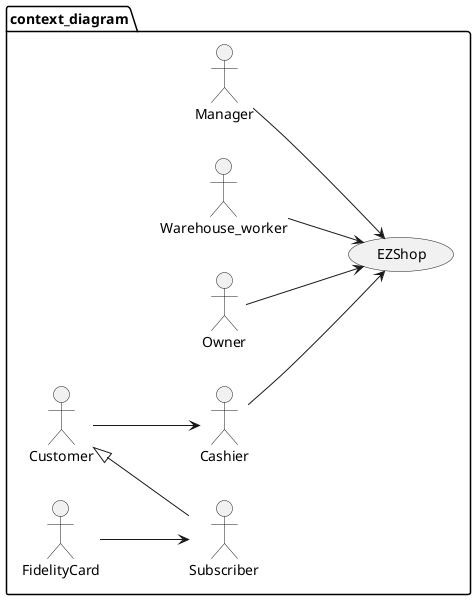
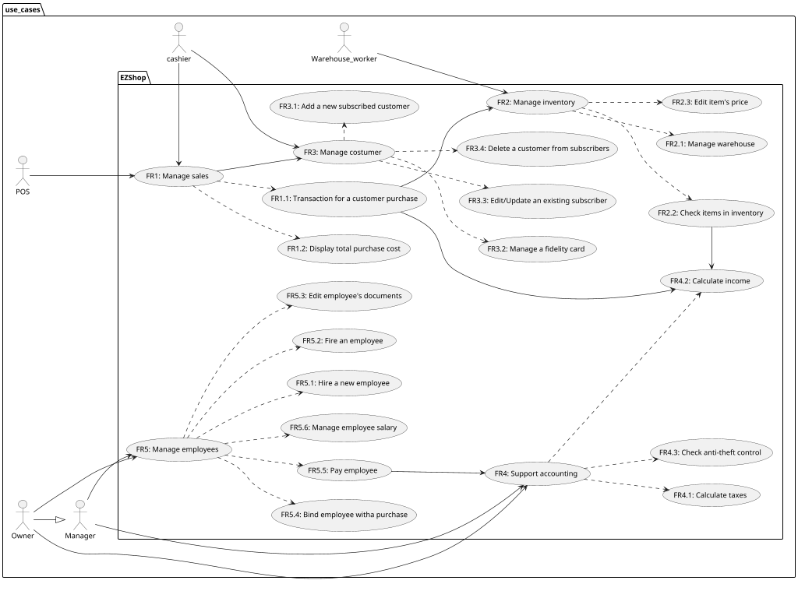
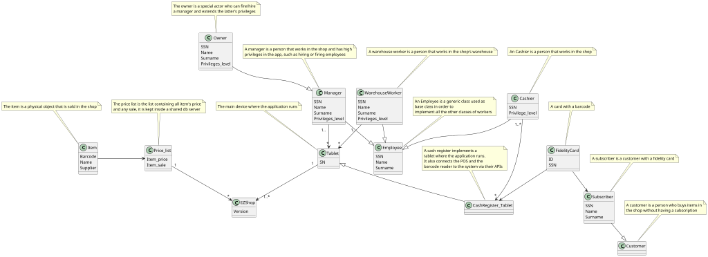
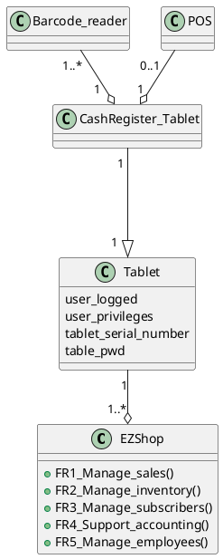
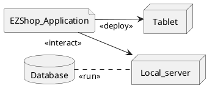

# Requirements Document

Authors: Roberto A., Michelangelo B., Gianvito M., Roberto T.

Date: 20/04/2021

Version: 1.2

# Contents

- [Essential description](#essential-description)
- [Stakeholders](#stakeholders)
- [Context Diagram and interfaces](#context-diagram-and-interfaces)
	+ [Context Diagram](#context-diagram)
	+ [Interfaces](#interfaces)
- [Stories and personas](#stories-and-personas)
- [Functional and non functional requirements](#functional-and-non-functional-requirements)
	+ [Functional Requirements](#functional-requirements)
	+ [Non functional requirements](#non-functional-requirements)
- [Use case diagram and use cases](#use-case-diagram-and-use-cases)
	+ [Use case diagram](#use-case-diagram)
	+ [Use cases](#use-cases)
    	+ [UC1](#use-case-1-UC1)
        + [UC2](#use-case-2-UC2)
        + [UC3](#use-case-3-UC3)
        + [UC4](#use-case-4-UC4)
        + [UC5](#use-case-5-UC5)
- [Glossary](#glossary)
- [System design](#system-design)
- [Deployment diagram](#deployment-diagram)

# Essential description

Small shops require a simple application to support the owner or manager. A small shop (ex a food shop) occupies 50-200 square meters, sells 500-2000 different item types, has one or a few cash registers.
EZShop is a software application to:
* manage sales
* manage inventory
* manage customers
* support accounting

# Stakeholders

| Stakeholder name        | Description                                               |
| ----------------------- |:---------------------------------------------------------:|
| End user                | Warehouse workers, cashiers, managers, owners             |
| Company that develops   | Soft eng, electro eng, marketing people, safety eng       |
| Maintainers             | The same company that develops the app                    |
| Certification authority | Company who gives digital certificate for security keys   |
| Suppliers, customers    | External users who interact with the user inside the shop |
| Fidelity card           | A card with barcode which define a subscriber             |

# Context Diagram and interfaces

## Context Diagram

## Interfaces

| Actor            | Logical Interface      | Physical Interface      |
| -----------------|:----------------------:| -----------------------:|
| Cashier          | GUI                    | On/off button           |
| ^                | Scan item command      | Barcode scanner         |
| ^                | POS (SumUp Native SDK) | POS (Physical Keyboard) |
| ^                | /                      | Cash Register Tablet    |
| Warehouse worker | GUI                    | Tablet                  |
| Manager/Owner    | GUI                    | Tablet                  |
| Fidelity Card    | /                      | Barcode Scanner         |

# Stories and personas

## Personas

* **Anna** is a 20 y/o student who lives alone and tries to save as money as possible in order to not waste her parent's and to be indipendent. So she is inclined to accept the terms of having a fidelity card to access all the possible shop's discounts. Since she is a university student, most of her friends lives like her and it is likable that she suggests the shop to them.

* **Luigi** is 40 y/o man who works for a big delivery company, he drives a big camion and he is always on time. He starts at 6:00 AM and finishes at 2:00 PM. He has two sons and he is divorced. He's a very extrovert person and likes to stay a lot in public places.

* **Mario** is 40 y/o man, he is  the warehouse worker of the shop. He is very accurate and careful, the manager trusts him a lot. He starts at 12:00 AM and finishes at 8:00 PM. He is not married but loves a girl called Peach.

* **Giovanni** is a 30 y/o factory worker. He is married with Roberta and has got 3 kids, of which 2 are twins that are 3 y/o and the other one is 1 y/o. He wakes up very early in the morning, typically at 6:00 AM, and goes to work at 7:30 AM. He is a very introvert person and is very frustrated in his life. When he has to do a task, like going to the shop, he prefers that the task is done without issues or slowdowns.

* **John** is a 50yo cashier. He works really hard to maintain his family. He tries to find every time new way to improve his job and to make it less harder. John has a dog and buys all the necessary products from the shop where he works. He tries every time to help who needs it.

## Stories

* Anna enters in the shop, buy some products and goes to the cash register. For the sales, she decides asks more informations to the cashier about the fidelity card. The cashier explains her all the advantages of having a fidelity card. Anna now is convinced and wants to request it. She gives all the necessary informations, the cashier compiles the form using them and release the fidelity card. Eventually she pays using credit card and starts to accumulate discount point on her new fidelity card.

* Luigi, after a 3 hours travel, arrives to the shop's warehouse to deliver the suppliers. Mario, his brother, marks the delivery on the tablet and controls the quality of the items.

* Giovanni, after a long day of work, decides to go to the shop to buy some food for the dinner. He enters the shop and goes through all the selection of the products. When he's done, he goes to the Cash Register to pay. He's got the fidelity card so he can obtain some discounts on the products prices. Finally, after the discounts have been applied, he can pay, exit the shop and go back home to eat.

* John is a cashier of the shop, every day he wakes up at 6:30am, goes to work at 7:30am and stays there until 17:30pm. If he decides to hire a friend through the EZShop application on his cash register, but the app will block him because his account has no privileges to do such operation (only a manager or the owner account can do so).

# Functional and non functional requirements

## Functional Requirements

| ID                                                               | Description                                                        |
| -----------------------------------------------------------------|:------------------------------------------------------------------:|
| **FR1 Manage sales**                                             | **Functions to manage the sales**                                  |
| - FR1.1 Transaction for a customer purchase                      | Start a new transaction                                            |
| -- FR1.1.1 Check the register number                             | Gives the number of the register where the sale will be done       |
| -- FR1.1.2 Electronic transaction                                | Transaction made by POS using SumUp Native SDK                     |
| --- FR1.1.1.1.1 Make the transaction through the POS             | Uses POS's APIs (SumUp Native SDK)                                 |
| -- FR1.1.3 Cash transaction                                      | Registers the new income                                           |
| -- FR1.1.4 Check for fidelity card                               | Reads the fidelity card's  barcode                                 |
| - FR1.2 Display total purchase cost                              | Shows the total cost for the transaction                           |
| **FR2 Manage inventory**                                         | **Functions to manage the inventory**                              |
| - FR2.1 Manage warehouse                                         | Gives the ability to manage the warehouse                          |
| -- FR2.1.1 warehouse receives the supply from the suppliers      | Manages the reception of the supplies                              |
| --- FR2.1.1.1 warehouse increase the items supply level          | It lets increase the items' number in inventory                    |
| - FR2.2 Check items in inventory                                 | Gives the ability to check items' presence in inventory            |
| -- FR2.2.1 Check only by name                                    | Checks if the item is in the database                              |
| -- FR2.2.2 Check quantity                                        | Checks the quantity of an item in the warehouse                    |
| --- FR2.2.2.1 Order new supply if the level is below a threshold | Checks if the number of items is below a threshold                 |
| ---- FR2.2.2.1.1 Make an order from the suppliers                | Makes an order from the suppliers                                  |
| -- FR2.2.3 Display item's price                                  | Shows an item's price                                              |
| -- FR2.2.4 Make dispute to the supplier for bad/damaged products | Gives the ability to make a dispute to a supplier                  |
| - FR2.3 Edit item's price                                        | Manage an item price                                               |
| **FR3 Manage subscribers**                                       | **Functions to manage the subscribers**                            |
| - FR3.1 Add a new subscribed customer                            | Function to add a new subscriber                                   |
| - FR3.2 Manage a fidelity card                                   | Gives the ability to manage a fidelity card                        |
| -- FR3.2.1 Check fidelity points                                 | It lets to get the point from a fidelity card's code               |
| -- FR3.2.2 Give gifts to subscriber after a threshold            | After subscriber reached certain amount of points, give a gift     |
| - FR3.3 Edit/Update an existing subscriber                       | Edits a subscriber's profile                                       |
| - FR3.4 Delete a customer from subscribers                       | Deletes a subscriber from the system                               |
| **FR4 Support accounting**                                       | **Functions that support accounting**                              |
| - FR4.1 Calculate taxes                                          | Calculates taxes                                                   |
| - FR4.2 Calculate income                                         | Calculates the income by summing all the payments amounts          |
| -- FR4.2.1 Analyze and display total income                      | Displays the total income                                          |
| -- FR4.2.2 Analyze and display net income                        | Displays the net income                                            |
| - FR4.3 Check anti-theft control                                 | Functions that control if there has been a theft                   |
| **FR5 Manage employees**                                         | **Functions to manage employees**                                  |
| - FR5.1 Hire a new Employee                                      | Add a new employee account                                         |
| -- FR5.1.1 Released the badge to the new Employee                | Adds a new employee to the system                                  |
| - FR5.2 Fire an Employee                                         | Disables employee's account                                        |
| - FR5.3 Edit employee’s documents                                | Edits the employee profile                                         |
| -- FR5.3.1 Manage employee's ID                                  | Manages the ID of the employees                                    |
| - FR5.4 Bind employee with a purchase (statistics)               | Shows how much income an employee has provided                     |
| - FR5.5 Pay employee                                             | Adds the employee to the list of the current month payed employees |
| - FR5.6 Manage employee salary                                   | Lets the owner or the manager manage an employee's salary          |

## Non Functional Requirements

| ID   | Type        | Description                                           | Refers to|
|------|:-----------:|:-----------------------------------------------------:|:--------:|
| NFR1 | size        | manage a maximum of 2500 item types                   | FR2      |
| NFR2 | size        | manage a maximum of 50 employees                      | FR5      |
| NFR3 | efficiency  | be able to complete actions in less than 3 clicks     | All FR   |
| NFR4 | portability | deployable on different operating systems (Java)      | All FR   |
| NFR5 | speed       | low latency (1 seconds for action)                    | All FR   |
| NFR6 | ease of use | time to learn how to use for non engineer < 15minutes | All FR   |
| NFR7 | efficiency  | response time to any (virtual) button pressed <1sec   | All FR   |
| NFR8 | robustness  | availability at least 99%                             | All FR   |

# Use case diagram and use cases

## Use case diagram

## Use cases

### Use case 1, UC1

| Actors Involved  | Cashier, Customer, POS, Barcode scanner |
| ---------------- |:---------------------------------------:|
| Precondition     | Cash register tablet is ON              |
| ^                | Barcode scanner is ready                |
| ^                | Item’s barcode is valid                 |
| ^                | POS is connected                        |
| Post condition   | /                                       |
| Nominal Scenario | 1.1                                     |
| Variants         | 1.2, 1.3                                |

| Scenario 1.1   |                                                |
| -------------- |:----------------------------------------------:|
| Precondition   | Cash register tablet is ON                     |
| ^              | Barcode scanner is ready                       |
| ^              | Item’s barcode is valid                        |
| ^              | POS is connected                               |
| Post condition | /                                              |
| Step#          | Description                                    |
| 1              | The cashier scans the items                    |
| 2              | The cashier scans the fidelity card (optional) |
| 3              | The display shows the price of the transaction |
| 4              | The transaction is made (cash or POS)          |
| 5              | After confirm, print receipt                   |
| 6              | Update warehouse inventory                     |

| Scenario 1.2   |                                                |
| -------------- |:----------------------------------------------:|
| Precondition   | Cash register tablet is ON                     |
| ^              | Barcode scanner is ready                       |
| ^              | Item’s barcode is valid                        |
| ^              | POS is not connected                           |
| Post condition | Cash is available or want to retry transaction |
| Step#          | Description                                    |
| 1              | The cashier scans the items                    |
| 2              | The cashier scans the fidelity card (optional) |
| 3              | The display shows the price of the transaction |
| 4              | The transaction is made with POS               |
| 5              | Transaction fails                              |

| Scenario 1.3   |                                                |
| -------------- |:----------------------------------------------:|
| Precondition   | Cash register tablet is ON                     |
| ^              | Barcode scanner is ready                       |
| ^              | Item’s barcode is not valid                    |
| ^              | POS is connected                               |
| Post condition | Items returned to warehouse                    |
| Step#          | Description                                    |
| 1              | The cashier scans the items                    |
| 2              | Item is not recognized (barcode not valid)     |
| 3              | Ignore item and keep scanning                  |
| 4              | The cashier scans the fidelity card (optional) |
| 5              | The display shows the price of the transaction |
| 6              | The transaction is made with cash              |
| 7              | Print receipt                                  |
| 8              | Update warehouse inventory                     |

### Use case 2, UC2

| Actors Involved  | Manager, Owner, Warehouse workers |
| ---------------- |:---------------------------------:|
| Precondition     | /                                 |
| Post condition   | Items are guaranteed              |
| Nominal Scenario | 2.1                               |
| Variants         | 2.2                               |

| Scenario 2.1   |                                        |
| -------------- |:--------------------------------------:|
| Precondition   | /                                      |
| Post condition | There is no need to order the item     |
| Step#          | Description                            |
| 1              | The actor involved search for the item |
| 2              | The item is found                      |
| 3              | Item quantity is printed and is enough |

| Scenario 2.2   |                                                            |
| -------------- |:----------------------------------------------------------:|
| Precondition   | /                                                          |
| Post condition | The cost for the order is registered in the accounting     |
| Step#          | Description                                                |
| 1              | The actors involved search for the item                    |
| 2              | The item is found                                          |
| 3              | Item quantity is printed but it’s lower than the threshold |
| 4              | An order to the supplier is made                           |

### Use case 3, UC3

| Actors Involved  | Manager, cashier, subscriber          |
| ---------------- |:-------------------------------------:|
| Precondition     | SSN is not already in the database    |
| Post condition   | A new fidelity card has been released |
| Nominal Scenario | 3.1                                   |
| Variants         | 3.2                                   |

| Scenario 3.1   |                                                     |
| -------------- |:---------------------------------------------------:|
| Precondition   | SSN is not already in the database                  |
| Post condition | A new fidelity card has been released               |
| Step#          | Description                                         |
| 1              | The subscriber asks for the fidelity card benefits  |
| 2              | The cashier explains them                           |
| 3              | The subscriber decides to subscribe                 |
| 4              | The cashier inserts subscriber info in the app form |
| 5              | The fidelity card gets linked to the subscriber     |
| 6              | The fidelity card is released to the subscriber     |

| Scenario 3.2   |                                                                                                             |
| -------------- |:-----------------------------------------------------------------------------------------------------------:|
| Precondition   | SSN is already on the database                                                                              |
| Post condition | A new fidelity card hasn't been released                                                                    |
| Step#          | Description                                                                                                 |
| 1              | The subscriber asks for fidelity card benefits                                                              |
| 2              | The cashier explains them                                                                                   |
| 3              | The subscriber decides to subscribe                                                                         |
| 4              | The cashier inserts subscriber info in the app form                                                         |
| 5              | The cashier receives an error which say the user is already registered in the database                      |
| 6              | The cashier tell customer is already registered and has the possibility to buy a copy of the fildelity card |

### Use case 4, UC4

| Actors Involved  | Manager, Owner                    |
| ---------------- |:---------------------------------:|
| Precondition     | The shop was open during that day |
| Post condition   | Total daily income is calculated  |
| Nominal Scenario | 4.1                               |
| Variants         | 4.2                               |

| Scenario 4.1   |                                                                 |
| -------------- |:---------------------------------------------------------------:|
| Precondition   | The shop was open during the day                                |
| ^              | The manager/owner log in to obtain a period income              |
| Post condition | Total period income is calculated                               |
| Step#          | Description                                                     |
| 1              | The actor involved selects the period where to calculate income |
| 2              | The actor has the access granted and the period is valid        |
| 3              | The calculated income is printed                                |

| Scenario 4.2   |                                                                               |
| -------------- |:-----------------------------------------------------------------------------:|
| Precondition   | The shop was open during the day                                              |
| ^              | A cashier log in to obtain a period income                                    |
| Post condition | The cashier cannot see the income because it does not have enough permissions |
| Step#          | Description                                                                   |
| 1              | The actor involved tries to request the income on a period                    |
| 2              | The actor has access denied because it does not have enough permissions       |

### Use case 5, UC5

| Actors Involved  | Manager, Owner                                 |
| ---------------- |:----------------------------------------------:|
| Precondition     | An actor publishes an ad to hire new employees |
| Post condition   | Employees are hired                            |
| Nominal Scenario | 5.1                                            |
| Variants         | 5.2, 5.3                                       |

| Scenario 5.1   |                                                                      |
| -------------- |:--------------------------------------------------------------------:|
| Precondition   | The actor wants to hire a new employee                               |
| Post condition | A new employee is hired                                              |
| Step#          | Description                                                          |
| 1              | The personal data of the new employee is inserted into an app's form |
| 2              | An ID number gets released to the new employee                       |
| 3              | A badge gets released to the new employee                            |

| Scenario 5.2   |                                                |
| -------------- |:----------------------------------------------:|
| Precondition   | The manager wants to hire an actual employee   |
| Post condition | The hiring does not happen                     |
| Step#          | Description                                    |
| 1              | The actors involved tries to hire the employee |
| 2              | The employee is already in the system          |
| 3              | Advise "Employee already in system" is shown   |

| Scenario 5.3   |                                                |
| -------------- |:----------------------------------------------:|
| Precondition   | A cashier wants to hire a new employee         |
| Post condition | The operation is halted                        |
| Step#          | Description                                    |
| 1              | The cashier tries to enter the management area |
| 2              | The privileges aren't enough high              |
| 3              | Advise "Not enough privileges" is shown        |

# Glossary

# System Design

# Deployment Diagram

